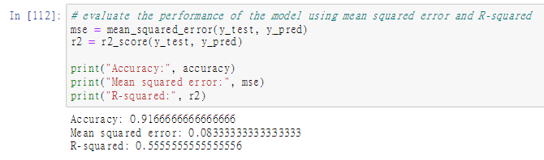
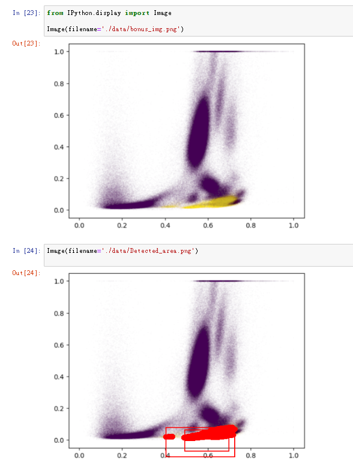

# AHEAD_Task
The task from AHEAD tech

### Task1 
- TASK: There are a group of patients who were diagnosed either COVID-19 positive (sick) or negative (healthy). Each FCS file represents the specimen collected from one patient. Build an automatic predictor using a ML model of your selection, the labels provided in the “EU_label.xlsx” as ground truth, and marker-channels with “use” = 1 in “”EU_marker_channel_mapping.xlsx” as ” as data features

### Bonus Question : 
 